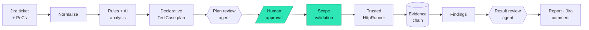

<div align="center">

<picture>
  <source media="(prefers-color-scheme: dark)" srcset="docs/assets/banner-dark.svg">
  <source media="(prefers-color-scheme: light)" srcset="docs/assets/banner-light.svg">
  
</picture>

<br>

[](https://github.com/Phat-SS/Security-Testing-platform/actions/workflows/ci.yml)


-ff5468?labelColor=0a0e13)
-6ca8ff?labelColor=0a0e13)


**Turn Jira security requirements and existing PoCs into an OWASP-aligned test plan,
run only what a human approved, and report findings backed by tamper-evident evidence.**

[Getting started](#getting-started) ·
[How it works](#how-it-works) ·
[Configuration](#configuration) ·
[Roadmap](#roadmap) ·
[Security](#security)

</div>

---

## Overview

**Sentinel** is an AI-assisted API security testing platform with a web UI, a
CLI, a JSON API and a read-only MCP server. It maps Jira security tickets to
the OWASP API Security Top 10 (2023), designs declarative tests, executes the
**approved** ones in a controlled way, collects tamper-evident evidence, and
writes findings back to a report and to Jira.

> [!NOTE]
> Runs **fully offline** out of the box: SQLite persistence, a deterministic
> (no-API-key) analyzer, and a mock Jira MCP. The AI (Claude) and live Jira MCP
> are feature-gated behind the same interfaces — flip them on with env vars,
> nothing below changes.

### Highlights

| | |
|---|---|
| 🛰️ **Jira → plan** | Ticket text, comments and attached PoCs become an OWASP-aligned plan of declarative `TestCase`s — rules first, AI second. |
| 🛡️ **Scope-validated** | DNS-aware, IP-pinned scope checks block SSRF, metadata and rebinding before a single packet leaves. |
| ✋ **Human-approved** | Nothing runs until a person approves it; destructive tests need a second confirmation. |
| 🔗 **Evidence-chained** | sha256-chained, redacted evidence and a signed report manifest. |
| 🚫 **Never executes PoC code** | PoCs are parsed statically and transpiled into data; only the reviewed `HttpRunner` sends traffic. |
| 🎯 **Low false positives** | A 200 is never a finding and a 404 is never proof of safety — every authorization test carries a positive control. |
| 🤖 **Advisory AI** | Plan-review and result-review agents, plus a Copilot — they propose; they never approve or overwrite a verdict. |
| 📦 **Imports & exports** | Python PoCs, Postman, Burp XML, JMeter, HAR, OpenAPI in; HTML, PDF, XLSX, JSON, Postman/Newman out. |

### Table of contents

- [How it works](#how-it-works)
- [Getting started](#getting-started)
- [Using the web UI](#using-the-web-ui)
- [What it can actually send](#what-it-can-actually-send)
- [Importing existing artifacts](#importing-existing-artifacts)
- [The Jira comment](#the-jira-comment)
- [Where the AI is allowed to act](#where-the-ai-is-allowed-to-act)
- [Configuration](#configuration)
- [Project layout](#project-layout)
- [Testing](#testing)
- [Upgrading](#upgrading)
- [Roadmap](#roadmap)
- [Security](#security)
- [Contributing](#contributing)
- [License](#license)

## How it works



### The one design decision everything hangs on

**The AI proposes; a trusted runner disposes.**

```
Jira → Normalize → Requirements + OWASP Rule Engine + AI → Declarative TestCase
     → Plan Review (agent) → Human Approval → Scope Validation → Trusted Runner
     → Evidence → Findings → Result Review (agent) → Report
```

The plan reviewer adds tests and names gaps; it cannot approve anything. The
result reviewer cannot rewrite a sealed verdict. A named deterministic
measurement, or a HIGH-confidence AI result that survives an adversarial
challenge and cites captured evidence, may instead produce an append-only,
hash-bound derived verdict. The promotion decision stays separate and auditable.

Untrusted PoC code is **never executed**. A PoC is parsed statically and
transpiled into a declarative `TestCase` (data, not code). The only thing that
sends packets is the reviewed `HttpRunner`. This removes arbitrary code
execution from the platform entirely — the biggest risk in a tool like this.

Three non-negotiable controls, each with its own tests:

| Control | Module | Why |
|---|---|---|
| **Scope validation** (DNS-aware, IP-pinned) | `app/core/scope.py` | A pentest tool aimable anywhere is a weapon. Blocks SSRF/metadata/rebinding, not just by hostname but by *resolved IP*. |
| **Secret redaction** | `app/core/redaction.py` | A report that leaks its own bearer token is an incident. Runs before any store/log/report. |
| **Approval gate + evidence chain** | `app/execution/` | No unapproved test runs; evidence is sha256-chained and tamper-evident (see the honest scope of that claim in `evidence.py`). |

#### Two rules, not one

The anti-false-**positive** rule: an HTTP 200 is **never** a vulnerability on
its own. A `FAIL` requires correlated evidence — the attacker's response
actually contained the victim's data, or a read-back proved the attacker's
value persisted. Uncertain results are `INCONCLUSIVE`, firewall-blocked ones
are `BLOCKED` — never silently promoted to `PASS` or a finding.

The anti-false-**negative** rule: an HTTP 404 is **never** proof of safety on
its own either. A rejection only means the control worked if the thing being
protected was reachable to begin with. Every authorization test therefore
carries a **positive control** (`baseline`): the same request, performed by an
identity entitled to it. If the legitimate owner also gets 404, the test never
exercised the control and the result is `INCONCLUSIVE` — not a confident
`PASS`. See `app/execution/verdict.py`.

Evidence is ranked, strongest first: verification read-back → correlated
disclosure → directly observed missing header/limit → status code (weakest,
never decisive alone).

Production evidence correlation uses `EVIDENCE_FINGERPRINT_KEY` (HMAC, so raw
identity values are not stored). OAST-backed SSRF/redirect tests use the
provider-neutral `OAST_PUBLIC_URL`/`OAST_POLL_URL` contract. Reports include a
manifest signed with `REPORT_SIGNING_KEY` (32+ characters). See
[docs/configuration.md](docs/configuration.md).
These settings can also be managed under **System → Settings** in the sidebar;
stored secret values are never sent back to the browser, and saving requires
the admin role when authentication is enabled.

Before promoting a new Claude model or prompt, score its captured shadow output
against a reviewed JSONL golden set:

```bash
python -m app.evals candidate.jsonl --baseline production.jsonl
```

The gate checks finding precision/recall, invented evidence references, and
the share of executions still requiring manual review.

## Getting started

### Prerequisites

| Need | For |
|---|---|
| **Python 3.11+** | everything (CI runs 3.11 and 3.12) |
| Node.js 18+ *(optional)* | `npm run security:ui`, and the one-click Jira OAuth refresh (`npx mcp-remote`) |
| [Claude Code](https://claude.com/claude-code) CLI *(optional)* | `USE_AI=true` — every AI call goes through `claude -p` |
| Docker *(optional)* | `docker compose up`, and the isolated Python-PoC sandbox |

### 1. Install

```bash
git clone https://github.com/Phat-SS/Security-Testing-platform.git
cd Security-Testing-platform
python -m venv .venv
.venv\Scripts\Activate.ps1          # Windows PowerShell
# source .venv/bin/activate         # macOS / Linux
pip install -r requirements.txt
pytest                              # optional: the full suite (see Testing)
```

### 2. The self-contained demo

```bash
python -m demo.run_assessment
```

Spins up a deliberately vulnerable CRM API on `127.0.0.1`, runs two approved
tests, writes `reports/assessment_demo.html`: `API1-001` (BOLA) → **FAIL** with
the correlated data leak as evidence; `API2-001` (unauth read) → **PASS**.

### 3. The web UI (import → analyze → design → approve → execute → report → Jira)

```bash
# terminal 1 — a target to test (the bundled vulnerable app)
python -m uvicorn demo.vulnerable_api:app --port 8000
# terminal 2 — the platform
cp .env.example .env                                       # then set the two tokens
cp config/engagement.example.json config/engagement.json
python -m uvicorn app.api.main:app --port 8100
```

`.env` is read at startup by the app itself, so this and `npm run security:ui`
see the same configuration. Real environment variables still win over the file.

Open `http://127.0.0.1:8100`: import `CRM-1234`, check the extracted
**Endpoints** (edit them if the ticket's prose defeated the extractor), generate
the plan, approve the tests you want, **Run approved tests**, then open the
report or preview the Jira comment. Destructive (write-method) tests are
excluded from execution by default and gated behind a separate confirmation.

Start at **Engagement → Readiness** in the sidebar. It runs every base URL
through the same `ScopeValidator` the runner calls and lists, ahead of a run,
each setting that would stop one — with the fix inline (one click to authorize
a host) rather than a filename to go and edit. A whole run coming back
`BLOCKED` almost always means the target's host was never added to
`scope.allowed_hosts`; that check is the first row on the panel, and the
readiness verdict is also available as JSON at `/api/readiness` for CI.

### 4. The CLI

```bash
python -m app.cli CRM-1234 --engagement config/engagement.json --execute
```

Both reviewing agents run by default, and the deterministic half of each needs no
API key — so an offline CI run still prints "this plan has no test for the
category the ticket is about" and "4 of these results need a person". Every
agent-read result is printed with the word *advisory* attached, because a CI log
is exactly where that would otherwise get quoted as a confirmed break.
`--no-review` reproduces the pre-agent output exactly; `--review-rounds N` bounds
how many times the planner may answer the reviewer.

### 5. Running in Docker

```bash
cp .env.example .env
cp config/engagement.example.json config/engagement.json   # then edit it
docker compose up --build
```

Open `http://127.0.0.1:8100`. `docker-compose.yml` at the repo root builds
`docker/Dockerfile` — non-root, read-only application directory, dropped
Linux capabilities — and mounts `./config` read-only plus a named volume for
the SQLite file, so `docker compose down` never discards an assessment.
`docker compose --profile postgres up --build` adds a Postgres service
instead (see the compose file's header for the two extra `.env` lines it
needs). This is unrelated to `docker/docker-compose.yml`, which is the
isolated sandbox for `ENABLE_PYTHON_RUNNER` covered under "Multi-user auth"
below — that one exists to contain arbitrary Python, not to run the platform.

## Using the web UI

### The assessment screen

Four phases, shown one at a time, ordered so that what a thing is *derived from*
comes before the thing itself. `?phase=` carries which one, so a filtered plan
can be bookmarked and a save comes back where you were.

| Phase | What it is |
|---|---|
| **Scope** | What the ticket asks for, the attack surface those asks live on, and the OWASP coverage computed from it. The endpoint list is **editable** — and importable: paste or upload an OpenAPI 3 / Swagger 2 document and the list comes from the specification instead of from prose. |
| **Plan** | Import a PoC (Python / Postman / Burp / JMeter), pick a depth, generate — then the reviewing agent's verdict and its unresolved gaps, then search / filter / sort / page, then approve, reject or reset. |
| **Run** | Environment, adaptive toggle, the destructive-run gate, and the run itself — which happens in the background and reports as it goes: counts per verdict, and each failure the moment it is decided. |
| **Results** | Verdict counts, the run's assessment (passed/failed + % of the ticket covered), confirmed findings, re-run, report and exports. |

The page opens on wherever the assessment actually is: no plan yet opens Scope,
a plan awaiting approval opens Plan, an approved one opens Run. Two things sit
above the rail rather than inside a phase, because the person who needs them is
not the person standing on that phase: a **readiness verdict** that says this
run will come back entirely `BLOCKED`, and a **stale-plan warning** that says
the plan was built for a different endpoint list.

Every column header carries an **ⓘ** with the meaning of that column, so
`PARTIAL`, `From PoC` and `swap_object_id` do not require reading the source.

**Findings** and **Audit Log** in the sidebar answer the two questions that span
an engagement rather than one ticket: what is outstanding everywhere, and who
did what.

The sidebar has three groups: **Workspace** (Assessments, Findings),
**Engagement** (Readiness, Scope & Targets, Identities) and **System** (Audit
Log, Settings). The UI follows the OS light/dark preference, with a toggle in
the sidebar footer, and honours `prefers-reduced-motion`.

#### Endpoints are editable, and that matters

`TestDesigner` builds one test set **per endpoint**, and the OWASP mapping is
computed from these parameters — so this list is the single input the whole plan
is derived from. It is produced by a regex over ticket prose, which means it
misses endpoints written in a table, marks every endpoint as requiring auth, and
only finds object ids that appear in a *path*. Correcting any of that used to
mean editing the Jira ticket and importing again, which discarded the plan and
its approvals.

Editing the list is **additive** for the OWASP mapping: a new endpoint can add
or explain a category, but nothing here silently drops one — the mapping may
have come from the Claude analyzer reading the ticket's intent, and rebuilding it
from the heuristic rules on every small edit would quietly replace that with
something weaker. **↻ Re-analyze from ticket** is the one operation allowed to
remove a category; it keeps hand-entered endpoints, because those exist
precisely because the extractor could not find them.

Changing the list marks an existing plan **stale** rather than regenerating it
behind your back. Regenerating replaces the plan and **keeps an approval given to
a test that comes back byte-for-byte unchanged**; anything whose request or
mutation differs returns to `PENDING`.

#### Reviewing a large plan

Aggressive depth over a handful of endpoints is a hundred-plus tests. The plan
table filters, sorts and pages **server-side**, which is what makes *"approve all
312 matching this filter"* mean the same thing you just read on screen — the
bulk action re-runs the same query rather than trusting a list of ids the page
happened to render. Filter values come with counts and only appear if the plan
actually contains them.

`Approve` / `Reject` / `Reset to PENDING` are all available from the list.
Unchecking a box never withdrew an approval — the handler only ever read the
boxes that *were* ticked — so withdrawing one is now an explicit action.

#### Re-running

**↻ Re-run** (on a card or in step 6) creates a **new assessment** of the same
issue, copies the analysis and the plan *with its approvals*, runs the approved
**non-destructive** tests, and lands on the regression diff. The previous run is
left exactly as it was, as the baseline.

It has to work that way. Regression only exists *between* assessments, and
findings are derived from every execution an assessment holds — so re-running in
place would rewrite the conclusions attached to evidence that had already been
reported. Two things deliberately do not come along: destructive tests
(approving a write probe once, for a run you watched, is not consent to it firing
again from a button on a list page) and adaptive follow-ups (authorised by policy
mid-run, never read by a person). **Re-import from Jira** is the other mode, for
when the ticket itself changed.

A re-run stops before sending anything and says why — no environment, nothing
approved, or a blocking configuration check — rather than reporting a run that
came back entirely `BLOCKED`.

### Working with the list

Every row and card keeps its actions (Edit, Delete, Re-run, Make Default…) in
one **⋯** menu; destructive items sit last and ask for confirmation. On
**Assessments**, tick cards to select them and use **Delete Selected**; the
route re-checks each id against the caller's engagements, because it sits
outside `/assessment/{aid}` where the isolation middleware works. Two charts
above the list show findings by severity (a single-hue ordinal scale) and test
outcomes per run, each with a legend, per-mark tooltips and a table view.

### Regression testing

**↻ Re-run** on an assessment card clones the plan into a new assessment, runs
the approved non-destructive tests and opens **Regression diff**
(`/assessment/{id}/regression`): findings matched against the previous executed
run by dedup key, as *new (regressions) / fixed / still-open*, plus a Jira-ready
note. Schedule it with OS cron or CI calling `python -m app.cli <ISSUE>
--execute`.

Running the *same* assessment twice is also supported and appends to its
evidence chain: execution ids are tagged per round so two runs are never
indistinguishable in the evidence, and findings are recomputed over the whole
history and replaced rather than appended.

### Copilot, HAR import and the MCP server

- **Copilot** (assessment screen, right-hand panel): hypotheses that cite the
  executions behind them, and next probes worth sending. It always has a free
  rules-only brief; with `USE_AI=true` it asks Claude through the same
  `claude -p` CLI as every other stage, and you can ask it a question. Every AI
  claim is checked before it is shown — an execution id that does not exist, an
  endpoint the assessment does not have, or a mutation outside the registry is
  dropped and counted. **Add To Plan** hands a step to the attack planner, so
  the resulting test passes `AttackPlanner.accept()` and lands PENDING.
- **AI spend.** `AI_ASSESSMENT_BUDGET_USD` caps the total AI spend of one
  assessment (per process). A transient CLI failure is retried
  (`AI_CLI_RETRIES`), and `ANTHROPIC_MODEL_FAST` can run ticket extraction on a
  smaller model.
- **HAR import.** The Scope phase's **Import Endpoints** accepts a HAR capture
  (browser network panel, Burp, Caido) as well as OpenAPI/Swagger. Only names
  are kept — never header values, cookies or bodies — and requests to any host
  but the capture's main one are skipped and listed.
- **MCP server.** `python -m app.mcp.server` exposes the platform to another
  agent over stdio, read-only: list assessments, read one, read findings, read
  or rebuild the Copilot brief. No tool sends traffic, approves or runs anything.
  `MCP_ENGAGEMENT` restricts it to one engagement.

## What it can actually send

The attack vocabulary is a closed registry — `app/execution/mutations.py`,
`MUTATION_KINDS`. Every entry has a reviewed handler; there is no path from a
generated or AI-proposed test to a behaviour that isn't listed here, and an
unknown kind is rejected rather than improvised.

| Category | Mutations |
|---|---|
| **API1** BOLA | `swap_object_id`, `swap_id_in_query`, `swap_id_in_header`, `id_param_pollution`, `wrap_id_array`, `content_type_switch` |
| **API2** Auth | `drop_auth`, `tamper_token`, `jwt_alg_none`, `jwt_alg_confusion`, `jwt_claim_tamper`, `jwt_expired_replay`, `jwt_kid_injection`, `borrowed_token` |
| **API3** BOPLA | `inject_property`, `inject_nested_property` |
| **API4** Resources | `oversized_payload`, `pagination_abuse`, `json_depth_bomb`, `rate_probe`, `graphql_batching_abuse` |
| **API5** BFLA | `escalate_persona`, `method_override`, `admin_path_swap` |
| **API6** Business flows | `repeat_flow`, `race_condition` |
| **API7** SSRF | `ssrf_url`, `ssrf_url_bypass` |
| **API8** Misconfiguration | `cors_probe` (foreign and `null` origin), `debug_probe`, `security_headers_probe`, `host_header_injection`, `type_confusion_probe` |
| **API8** Injection (aggressive) | `sqli_error_probe`, `nosqli_operator_probe`, `ssti_probe`, `path_traversal_probe`, `crlf_injection_probe` — detect-only, see below |
| **API9** Inventory | `version_downgrade`, `undocumented_path_probe`, `graphql_introspection_probe` |
| **API10** Unsafe consumption | `unsafe_redirect_url`, `oauth_redirect_uri_bypass` |

All ten categories have generators. `rate_probe`, `repeat_flow` and
`race_condition` send multiple requests (capped at 50); `race_condition` sends
them concurrently, inside a single DNS-pin block so every request in the burst
goes to the one already-validated address.

**Depth.** `standard` (default) emits the highest-value probe per applicable
category. `aggressive` emits the full variant matrix — every id placement, the
whole JWT suite, race windows. Choose it in the Design step, or
`--depth aggressive` on the CLI. Volume is not risk here: nothing runs without
approval, so the cost is review time.

`graphql_introspection_probe`, `graphql_batching_abuse`, `host_header_injection`
and `oauth_redirect_uri_bypass` used to be reachable only through the attack
planner (`USE_AI=true`), because the deterministic designer had no signal for
"this route is GraphQL / an OAuth authorize endpoint". It has one now — the path,
and the fields an imported specification declares — so an offline run tests them
too. A ticket about a GraphQL API no longer produces a plan with no GraphQL test
in it while the coverage table reads as covered.

**Injection probes** are detect-only and come with `aggressive` depth. Each is
judged by an oracle the payload cannot satisfy on its own: a database error
string, the product of a template evaluating `73331*91237`, the first line of
`/etc/passwd`, or a response header that only exists if CR/LF split one. A
target that merely echoes the input is not reported. No payload carries a
second statement, and time-based blind variants are deliberately absent.

**Out-of-band proof.** `INTERACTSH_SERVER` points SSRF and redirect probes at an
interactsh server, which sees DNS as well as HTTP callbacks. The generic
`OAST_PUBLIC_URL`/`OAST_POLL_URL` contract still works.

**Request pacing.** `RUNNER_MAX_RPS` caps the whole run's request rate across
concurrent tests; a probe's own burst (rate limit, race) is exempt. When the
target answers 429/503 every later request waits for its `Retry-After` (capped);
the 429 itself is recorded, never resent.

**Concurrency.** `max_concurrent_tests` (System → Settings) is how many
approved tests are in flight at once. It defaults to **1**, which runs a plan
strictly sequentially. Raising it is what makes a 300-test plan finish in a
minute rather than five, at proportionally higher request rate against the
target — a blast-radius decision for whoever signed the authorization, which is
why it is not raised for you. The evidence chain is unaffected either way: tests
run in parallel and are sealed afterwards in plan order, so the record is
identical and reproducible.

## Importing existing artifacts

All flow through the same "parse-as-data, never execute, strip host, run
scope-validated" path:

- **Python PoC** — `app/poc/transpiler.py`, `ast`-parsed; dangerous calls
  (`os.system`, `eval`, `subprocess`, …) are flagged and the PoC is never run.
- **Postman collection (v2.1)** — `app/poc/postman.py`, nested folders supported.
- **Burp Suite XML export** — `app/adapters/burp.py`, raw-HTTP requests parsed.
- **JMeter `.jmx`** — `app/adapters/jmeter.py`, HTTP samplers parsed.

And you can **export** the approved plan back out:

- **Postman/Newman** — `/export.postman` emits a collection with `{{baseUrl}}` +
  `{{token_*}}` variables (never real secrets) and per-request assertions.
- **Report** — HTML, **PDF** (`/export.pdf`), **XLSX**, **JSON**.

### A ticket with two PoC scripts

A ticket that files an unauthenticated-reach script *and* a cross-tenant-write
script is describing one finding in two steps, and a plan built from the first
one covers half of it. `app/poc/jira_extract.py` finds all of them:

* **everywhere they hide** — description, follow-up comments, and `.py`
  attachments when the connector can supply the bytes. A `.py` attachment it
  cannot download is *named* on the Design step rather than silently absent,
  because a ticket with two PoCs reported as a ticket with one is the failure
  worth preventing;
* **in the syntax they were written in** — markdown fences, Jira's native ADF
  `codeBlock` (which contains no backticks at all, and so used to be invisible
  to a fence scanner — `app/mcp/adf.py` now renders it as a real fenced block),
  `{code:python}` wiki markup, and bare fences that actually parse as Python and
  call an HTTP library. A JSON request body or a curl line in a bare fence is
  left alone: `{"owner_id": 4711}` is valid Python, so parseability alone is not
  enough to tell a payload from a PoC;
* **named** — from a label line above the block (`**01_reach.py**`, `h3.
  01_reach.py`, `PoC 1: 01_reach.py`), a `{code:title=…}`, or the script's own
  first-line comment.

The Design step's textarea shows them as one banner-separated blob, because that
is what an editable field can hold — but the page now says how many scripts
there are and where each came from, and **each file is transpiled on its own**.
That last part is not cosmetic: `transpile_python` walks a single symbol table in
source order, so two scripts that each open with `BASE = "https://…"` — or each
define their own `def send(...)` — resolve the *second* file's definitions into
the *first* file's requests, silently, producing test cases aimed at a path
nobody wrote. Every generated test carries `source_ref` ("PoC
02_change_ownership.py"), and a syntax error in one script no longer takes the
other one down with it.

## The Jira comment

Most stakeholders never open the HTML report — they read the ticket. So the
comment (`app/reporting/jira_comment.py`) carries exactly two things:

- **the summary** — what was run, the verdict counts, whether the run passed and
  how much of the ticket it covered, and one row per confirmed finding;
- **the full results table** — one row per test, every test: the attack, the
  request as sent, the status, the verdict, and (once the results have been
  reviewed) what the reviewing agent made of the undecided ones.

Everything that *explains* a row lives in the HTML report: the mutation's
parameters, what a secure system was expected to return versus what came back,
the verdict's reasoning, the baseline and read-back exchanges it leaned on, and a
finding's impact, reproduction steps and recommended fix.

It used to carry all of that per test. On a 60-test run that is thousands of
words in a ticket comment, and the practical result was that the thing worth
reading sat below several screens of things that did not fail. Length is not
thoroughness in a place people skim, and two renderings of the same explanation
drift — the one in the ticket being the copy nobody updates. The report has room
for the explanation and, more to the point, has the captured request and response
the explanation refers to sitting directly beneath it.

Set `PLATFORM_BASE_URL` and the comment links to the report. Unset, it names it:
a localhost link 404s for every reader but its author, which costs more trust
than an absent one.

**What the comment deliberately withholds.** It goes to a system with a
different audience and a different access-control model than the evidence
store, so a leaked value is never reproduced in it. A BOLA finding reports
"the response disclosed 2 protected marker(s)" and points at the captured
response body; it does not paste the victim's email into the ticket. Every
string still passes `redact_text` on the way out, table cells escape pipes and
collapse newlines (paths come from tickets and imported PoCs, so they are
attacker-adjacent input), and anything dropped for length is announced rather
than silently truncated.

## Where the AI is allowed to act

Two agent roles, both bolted onto the same seam: **the AI proposes, the
platform disposes.** Both are off unless `USE_AI=true` and the `claude` CLI is
available; with them off the platform behaves exactly as the deterministic
path always did.

Every AI call (`ClaudeLLM` in `app/analysis/staged.py`) shells out to
`claude -p` with `--tools ""`, `--safe-mode` and `--no-session-persistence`,
run from outside this repo's working directory — the model only ever returns
text, it is never given the ability to run a tool, reach an MCP server, load
this or any other project's `CLAUDE.md`/hooks/skills/plugins, or persist the
turn. That matters because these prompts are built from Jira ticket text,
i.e. attacker-controlled input: without this, prompt injection in a ticket
could try to make the model *act* rather than just answer, on the same host
running this platform. `tests/test_claude_llm.py` pins the exact flags so a
refactor that quietly drops one fails CI instead of only outrunning this
paragraph.

**1. Attack planner** (`app/analysis/attack_planner.py`) — runs in the Design
step, after the rule engine, and sees what is already planned so it adds depth
rather than duplicates. Its output is refused unless: the mutation is in
`MUTATION_KINDS`, the path is relative (a proposal can never carry its own
host), every persona already exists in the vault, and the batch is under the
cap. `approval_status` is forced to `PENDING` and destructiveness is recomputed
from the HTTP method — **a proposal cannot approve itself**. Every rejection is
audited individually, so "the AI proposed 12 and 9 vanished" is never something
you have to infer from a count.

**2. Adaptive exploitation loop** (`app/execution/adaptive.py`) — the one place
a request is sent that no human read first, so it is bounded on four axes:
iterations, follow-ups per iteration, total follow-ups, and wall clock.
Destructive follow-ups are always excluded from the UI and API, even on a run that
includes destructive tests a human approved. Each follow-up passes the
planner's constraints *and* a second policy gate, and is labelled
`[AUTO-APPROVED by adaptive policy … Not individually reviewed by a human]` in
the report — because "a human approved this" and "a policy permitted this" are
different assurances and must not read alike.

**Prompt injection is assumed, not detected.** The loop feeds the target's own
response back to the planner, and a hostile target can put instructions there.
The response is redacted, truncated and fenced as untrusted — but that is
labelling, not a control. The control is that a fully injected, fully obedient
planner can still only select a different *allowlisted, non-destructive*
mutation against an *in-scope* host. It cannot widen scope, execute code,
escalate to a destructive probe, or approve anything, because the model decides
none of those.

**3. Plan reviewer** (`app/analysis/plan_reviewer.py`) — a second opinion on a
generated plan, before a human spends their attention on it. The failure mode it
exists for is a plan that is *thin in a way nobody notices*: a ticket whose third
acceptance criterion is about admin re-assignment, and a plan with eleven BOLA
probes and no BFLA test at all. It judges two axes — **coverage** (is there a
test for each security-relevant thing the ticket asks for?) and **decidability**
(can each test produce a verdict other than INCONCLUSIVE? an authorization probe
with no positive control cannot) — and its gaps are fed back to the planner for a
bounded number of revision rounds. The revised batch passes exactly the same
constraints as any other proposal.

It runs in two halves. The **structural** half is countable and always available:
an applicable OWASP category with no test, a requirement item nothing addresses,
an authorization test with no baseline. The **AI** half reads the ticket's intent
and names what a structural check cannot see. The AI half is strictly additive —
it can add gaps and lower the scores, and the structural verdict floors the final
one, so a model that decides everything is fine cannot erase a gap that is
measurably there.

**4. Result adjudicator** (`app/analysis/adjudicator.py`) — `INCONCLUSIVE` is the
runner being honest, and the bill for that honesty is paid by a person reading
response bodies. Most of that is not judgement, it is reading, and a good deal
of it is not even reading — it is *arithmetic over two responses*. So one review
pass runs four tiers, cheapest and most reproducible first, and only what
survives each tier goes on to the next:

**Tier 1 — triage** (deterministic, no key needed). Which bucket is this result
in, and *what kind of thing is in the way*: a failed positive control is a
test-data problem only a person can fix, a 500 is transient and wants a re-run,
a blocked request is a config question, and an accepted attack whose response
body is sitting right there is a reading task. The blocker is surfaced as its
own field, so the queue groups by *what would clear it* — "nine of these are one
stale object id" is a morning's work, "fourteen results need review" is a wall.

**Tier 2 — measurement** (`app/analysis/evidence_signals.py`, deterministic, no
key needed, and the tier that actually shrinks the queue). The evidence is
measured against the positive control before anybody reads it: which *layer*
answered (auth / object / input-validation / rate limiter, not just "a 4xx"),
what shape each body is, and — the load-bearing one — what share of the
*distinctive* values in the owner's response came back in the attacker's. Field
names, status words and small integers are excluded, because every response in
an API shares those and counting them would make every pair look like a leak.
Six narrow rules settle a result outright from that:

| Rule | Reads as | Why it is a measurement |
|---|---|---|
| `identical_body` | FAIL | the attacker got the owner's bytes |
| `correlated_disclosure` | FAIL | ≥75% of the owner's distinctive values came back, bodies not byte-equal (a timestamp differs) |
| `filtered_collection` | PASS | empty result set where the owner gets *n* records — the filter ran |
| `refusal_in_body` | PASS | a 200 whose body is a refusal envelope, not a resource |
| `throttled` | PASS | a rate limiter answered; the endpoint never processed it |
| `equivalent_refusal` | PASS | 401/403/404 are one security decision with different disclosure trade-offs, and *which* one a test expected is a guess about the implementation |

That last rule is the single largest source of avoidable review work in a real
run, and it is deliberately narrow: every expected status must itself be a
security refusal, the actual one too, and the response must share **none** of the
owner's distinctive values. A 404 carrying the victim's record is a disclosure
that happens to wear a refusal status, and it never reaches this rule. Nor does
"expected 401, got 400" — a validation rejection where authentication was
required is exactly the case where the control may never have run, which is what
a reader is *for*.

**Tier 3 — clustering.** What is left is grouped by the *reading task*, not the
result: same mutation, same endpoint shape, same status, same body shape, same
positive-control state, same answer to "did the owner's data come back". Rows
with the same key pose one question, so it is read once and every row that
inherited the answer names the sibling it came from. An aggressive run's forty
undecided rows are usually four questions.

**Tier 4 — reading**, by the model, on what is left, with the measured
differential handed to it as fact rather than two JSON blobs to eyeball. When it
wants to settle a result, a **second adversarial pass** is asked to refute its
own answer (`_CHALLENGE_SYSTEM`); an objection sends the row back to a person
with the objection attached. A challenge that cannot be obtained leaves the
first answer standing and says so — the net failing to deploy must not leave you
worse off than never having had one — but it never stamps "two passes agreed" on
a reply that agreed with nothing. Set `ADJUDICATOR_CHALLENGE=false` to skip it.

Every settled row says *how* it was settled (`resolution`: measured / read /
read-and-challenged / carried), and `RunAssessment` counts them apart, because
"twelve settled" and "twelve settled, ten of them by measurement with no model
involved" are different claims about how much of this you are taking on trust.

The review pass sends nothing by default. The one exception is opt-in from its
own checkbox: **also re-send the results that need only another attempt** (a 5xx
during the attack, a runner error) re-runs that bucket, bounded and audited,
skipping destructive tests — `rerun_execution`'s confirmation gate is honoured,
not worked around.

The result is an `Adjudication`: an opinion stored **beside** the sealed verdict,
carrying `advisory=True` and the sealed value alongside its own. It never writes
`execution.verdict`, never enters the evidence hash, and `build_findings` never
reads it. An agent that reads a result as broken changes what a tester has to
read and what the run-level assessment says; it does not change what this
platform reports as a confirmed finding. Everywhere it is rendered it names its
author, because "the runner sealed this as a break" and "an agent read this as a
break" are different claims resting on different evidence.

Rolled up, that answers the two questions a stakeholder asks: **did this run pass
or fail**, and **how much of the ticket did it cover** (`RunAssessment`). The
denominator is the requirement list (`app/analysis/requirements.py`), read out of
the ticket's acceptance criteria and security-relevant bullets — visible in step 1
so the percentage can be decomposed rather than taken on faith. An assessment
imported before that list existed has it back-filled from the stored ticket text
on first review, so an old run gets a figure instead of a permanent
"unmeasured"; **↻ Re-analyze from ticket** reads it properly. The
model may propose the readings and the test↔requirement mapping; the percentage
is arithmetic over them, computed in code, because a percentage a model asserted
is not a measurement. Coverage counts a requirement only when a test for it
reached a *decisive* result — a plan that touches everything and decides nothing
scores zero, deliberately.

**Where an agent is deliberately absent:** `core/scope.py`, `core/redaction.py`,
`execution/evidence.py`, the approval gate, and `execution/verdict.py`. Putting
a model in any of those converts an auditable control into a probabilistic one.
The two reviewing agents above are exactly the shape that lets them exist at all:
one adds proposals a human still approves, the other adds an opinion beside a
verdict it cannot touch.

```bash
python -m app.cli CRM-1234 --engagement config/engagement.json \
    --depth aggressive --execute --adaptive
```

## Configuration

Settings come from `.env` (read at startup; real environment variables win) and the engagement file. Every variable is documented in [docs/configuration.md](docs/configuration.md); most can also be edited under **System → Settings** in the sidebar.

### The engagement config = authorization as an artifact

Execution is impossible until an `engagement.json` defines the approved target,
scope allow/block lists, and persona credentials (see
`config/engagement.example.json`). No config → empty scope + no personas →
nothing runs. Authorization is explicit and reviewable, never inferred from a
ticket.

**More than one client, one process.** Point `ENGAGEMENTS_DIR` at a directory
and every `*.json` in it is an engagement, named after the file:

```
config/engagements/bmw-au.json     ->  "bmw-au"
config/engagements/acme.json       ->  "acme"
```

A single `ENGAGEMENT_CONFIG` install keeps working untouched and appears under
its own name — nothing has to be moved to upgrade. Discovery happens **only**
when one of those two variables names it: a directory of config files sitting on
disk beside the code is not a human saying where the authorization lives, and
default-deny is the first rule here.

Which engagement a request is about is decided per request, never globally. An
assessment records the engagement it was opened under and always resolves to
that one, so two tickets for two clients open in two tabs cannot aim one
client's run at the other's target. The sidebar's picker is for everything else,
and is deliberately absent on an assessment screen.

**What a run was authorized by is recorded with the run.** Before the first
request goes out, the scope, the identities, their ownership map and the runner
limits are frozen into a snapshot (never the credentials — it is meant to be
attached to a ticket), and its sha256 goes inside every sealed execution. A
report proves not only that a host was tested but that it was authorized at the
time; editing the scope afterwards no longer rewrites what an earlier run meant.

The **Engagement** and **System** sections of the sidebar edit that same file,
in four panes ordered the way a new engagement needs them:

| Pane | Writes | Blocks a run when unset |
|---|---|---|
| Readiness | — (read-only verdict, plus quick setup while the engagement is empty) | — |
| Scope & Targets | `environments`, `active_environment`, `scope.*` | yes — no target and no approved host mean every request comes back `BLOCKED` |
| Identities | `personas`, `attacker`, `victim` | yes — the runner resolves the attacker before scope is even checked |
| Settings | `runner` limits, plus AI/evidence settings written to `.env` | no — everything there has a working default |

**Quick Setup** on the Readiness pane does the whole first-run sequence in one
submit: the environment, its scope authorization, both personas, and both tokens
(to `.env`, referenced from the engagement file as `${PERSONA_A_TOKEN}`).

Every writer reads the whole document, changes only the keys it owns, and
writes it back, so hand-written comments and keys the UI does not expose
survive a save made through the browser.

**Persona tokens are references, not values.** `engagement.json` is the artifact
a tester reads, diffs and attaches to a ticket, so a live bearer token does not
belong in it. Write `"Authorization": "Bearer ${PERSONA_A_TOKEN}"` and keep the
token in `.env`; `load_engagement` resolves `${VAR}` from the environment at load
time. An unset or empty variable **withholds the header and fails readiness**
rather than falling back, because both fallbacks corrupt the result instead of
just weakening it: a literal `${VAR}` on the wire earns a 401 that reads in the
report exactly like a 401 the endpoint meant to return, and silently dropping the
header turns "identity A reaches B's object" into "anonymous reaches B's object",
where a PASS means nothing it appears to mean. The readiness row names the
variable to set, never its value.

### Feature flags

| Want | Set |
|---|---|
| Staged Claude analyzer instead of heuristic, plus the AI half of both reviewing agents | `USE_AI=true` + the `claude` CLI installed and logged in (rides your Claude Code login — no API key, no extra pip package) |
| A working report link in the Jira comment | `PLATFORM_BASE_URL=https://…` |
| Live Jira instead of the mock | `JIRA_MCP_URL=…` `JIRA_CLOUD_ID=…` (+ `pip install mcp`) |
| PostgreSQL instead of SQLite | `DATABASE_URL=postgresql+psycopg://…` |
| Reach a lab target on a private IP | **Scope & Targets → Allow private / loopback ranges** (lab only) |
| Run reviewed arbitrary-Python PoCs | `ENABLE_PYTHON_RUNNER=true` **and** `EGRESS_PROXY=…` (see below) |

### Multi-user auth

Off by default (single-user local-admin). To enable: create users and set
`AUTH_ENABLED=true`.

```bash
python -m app.core.auth add alice tester   # prints an entry + a one-time API key
```

Add the printed entry to `config/users.json`. Mutating routes then require
`X-API-Key` (or `Authorization: Bearer <key>`) with role ≥ tester; only the
SHA-256 hash of each key is stored. Reads stay open so the dashboard/monitoring
keep working.

For PoCs whose logic can't be expressed declaratively, the gated
`app/execution/python_runner.py` can execute them — but only with **all four
gates** satisfied (`ENABLE_PYTHON_RUNNER=true`, per-PoC `reviewed=True`, static
validation clean, and an `EGRESS_PROXY` allowlist). It fails closed and is off
by default. A subprocess is not a security boundary on its own — run it inside
container isolation with a network egress allowlist.

The real boundary ships in `docker/`: an isolated container (non-root,
read-only FS, dropped caps, no direct network) whose **only** egress is a
default-deny tinyproxy driven by `docker/allowlist` — the network-level
enforcement of your engagement scope. See `docker/docker-compose.yml`.

This is a separate image from the one that runs the platform itself
(`docker/Dockerfile`, `docker-compose.yml` at the repo root — see "Running in
Docker" below): the sandbox exists only to isolate arbitrary Python from
`ENABLE_PYTHON_RUNNER`, it is not how you'd normally deploy the app.

## Project layout

```
app/
  schemas/     # Pydantic contract: enums, TestCase, Execution, Finding, Analysis,
               #   agent.py            RequirementItem, PlanReview, Adjudication,
               #                       RunAssessment — all advisory by construction
  core/        # config, scope validator, redaction, engagement  ← security-critical
  owasp/       # API Top 10 2023 metadata, rule engine, coverage engine
  vault/       # persona credential vault (required for BOLA/BFLA)
  analysis/    # heuristic + Claude analyzer, deterministic test designer,
               #   requirements.py     what the ticket asks for (the coverage denominator)
               #   plan_reviewer.py    the reviewing agent (structural + AI)
               #   adjudicator.py      triage + reading of undecided results
  poc/         # static PoC transpiler (ast-based; never executes)
  execution/   # templating, mutations, trusted HTTP runner, verdict, evidence
  pipeline/    # executions → deduplicated findings
  reporting/   # HTML report + coverage matrix (dependency-free)
  database/    # SQLAlchemy models + repository (SQLite / Postgres)
  mcp/         # Jira MCP interface + mock (live SDK connector = drop-in)
  api/         # FastAPI app: web UI + JSON API
               #   ui.py               shared primitives: tooltip, section, table, theme
               #   views.py            dashboard, config, login, report-adjacent pages
               #   views/            one module per screen; views/assessment/
               #                     is the four phases, views/config/ the panes
               #   routes/           one module per part of the workflow
               #   runtime.py        the shared state, per-request engagement
  orchestrator.py  # the end-to-end workflow, wired to persistence
  cli.py       # command-line driver
demo/          # vulnerable target + sample tests + end-to-end runner
tests/         # scope, redaction, rules, verdict, evidence, approval, analysis,
               # transpiler, orchestrator, api, endpoint editing, plan filtering,
               # re-runs, plan/finding idempotency, assessment-screen structure
```

## Testing

```bash
pytest                       # the full suite (~20 min): safety controls + full pipeline
pytest tests/test_scope.py   # one area
ruff check app tests demo    # lint, as CI runs it
```

CI (`.github/workflows/ci.yml`) runs lint and the suite with coverage on Python
3.11 and 3.12, plus advisory jobs: bandit, pip-audit, mypy, gitleaks, hadolint,
and a `requirements.txt` ↔ lock consistency check. The CI job, not a number in
this file, is the source of truth for what passes.

## Upgrading

The evidence hash now covers the baseline/verification exchanges, multi-request
statistics and the attack note. Records sealed by an earlier version will
therefore **fail** `verify_chain` — the payload shape changed. That is the
correct failure direction: a hash whose definition silently varies proves
nothing. Re-run affected assessments, or archive their reports before upgrading.

`Verdict.actual_summary` no longer names the values a failing test disclosed,
only how many. Those fields are exported, rendered and posted to Jira with no
redaction pass of their own, so naming a leaked session token or a victim's
email there made the platform re-disclose the data it was reporting. The values
remain in the captured response body, which *is* redacted before storage.

### Database migrations

`app.database.models.init_db` (`Base.metadata.create_all`) still creates the
schema for a brand-new database — that has not changed, and tests keep using
it directly for exactly that reason. What it cannot do is add a column to a
database that already exists, which is why a schema change from here on ships
as an [Alembic](https://alembic.sqlalchemy.org/) migration under `migrations/`
instead. It reads `DATABASE_URL` the same way the app does, so it always
targets the database a normal run would use.

| Database | Command |
|---|---|
| Existing, from before Alembic | `alembic stamp 0001_baseline && alembic upgrade head` (once) |
| Brand new | `alembic stamp head` (create_all already built the current schema — this just tells Alembic to agree), or `alembic upgrade head` on an empty database to build it from the migrations instead |

`migrations/versions/0001_baseline.py` deliberately does nothing when *run* —
it exists to be *stamped*, marking "this database already has the schema
`create_all` has always produced," so later migrations know where they're
starting from without trying to re-create tables that are already there.

## Roadmap

- **Phase 1–2 (done):** schemas, scope, redaction, rule engine, vault, HTTP
  runner, verdict, evidence, findings, coverage engine, HTML report, heuristic
  analyzer + test designer, PoC transpiler, persistence, orchestrator, web UI +
  JSON API, CLI, demo. ✅
- **Phase 3 (done):** live Jira MCP connector (official MCP Python SDK) + ADF
  normalizer, staged Claude analyzer (LLM extracts, rule engine decides,
  Pydantic-validated, auto-fallback), Postman collection runner, gated isolated
  Python runner, JSON + XLSX export. ✅
- **Later (done):** Burp + JMeter importers, Postman/Newman export, PDF export
  (fpdf2), historical finding diff + regression view, multi-user API-key auth,
  Docker-composed sandbox (isolated container + egress-allowlist proxy). ✅
- **Agent layer (done):** requirement extraction, the plan-reviewing agent
  (structural + AI, with a bounded revision loop back into the planner), the
  result-adjudicating agent (deterministic triage + AI reading), the run-level
  passed/failed + %-of-ticket-covered assessment, and the Jira comment reduced to
  summary + results table with the explanation moved into the report. ✅
- **Beyond:** weasyprint HTML-fidelity PDF, cookie-login for the browser UI
  under auth, historical trend charts, notifications/scheduling UI, an editable
  requirement list in the UI (the endpoint list's treatment, applied to the other
  input a plan is derived from).

## Security

- Default-deny scope. Private/loopback/link-local ranges are blocked unless
  `scope.allow_private_ranges` is turned on in `config/engagement.json`
  (lab only — and it lives in that file, not in `.env`, because it is part of
  the authorization artifact a human reviews).
- Only run this against systems you are explicitly authorized to test.
- The bundled `demo/vulnerable_api.py` is intentionally insecure — never deploy it.

**Reporting a vulnerability in Sentinel itself:** please do not open a public
issue or PR. Tell the maintainers privately, with steps to reproduce, and wait
for a fix before discussing it anywhere shared.

## Contributing

1. Branch from `main`; keep one concern per pull request.
2. Run `ruff check app tests demo` and `pytest` before pushing.
3. Anything that sends traffic goes through `HttpRunner` and the scope
   validator — a change that adds another path to the network will not be merged.
4. A schema change ships as an Alembic migration under `migrations/`.
5. UI labels are Title Case and need a Vietnamese entry in the i18n table.

Brand assets in `docs/assets/` are generated: edit
`scripts/brand/build_assets.py` and run
`python scripts/brand/build_assets.py --png`, never the SVGs by hand.

## License

Proprietary — all rights reserved. See [LICENSE](LICENSE). Use, copying or
distribution requires written permission from the copyright holders.
